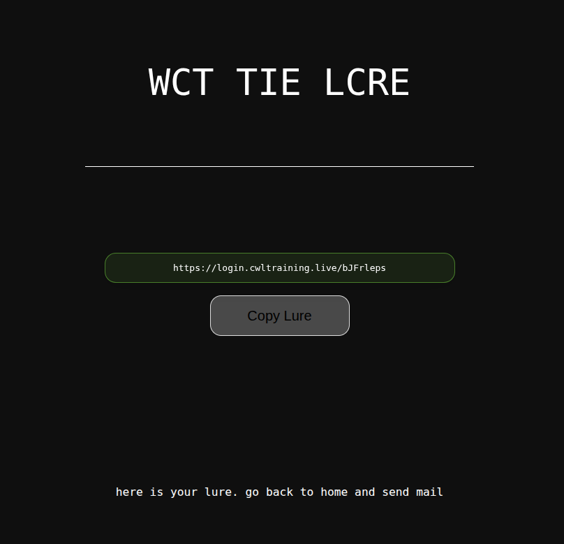
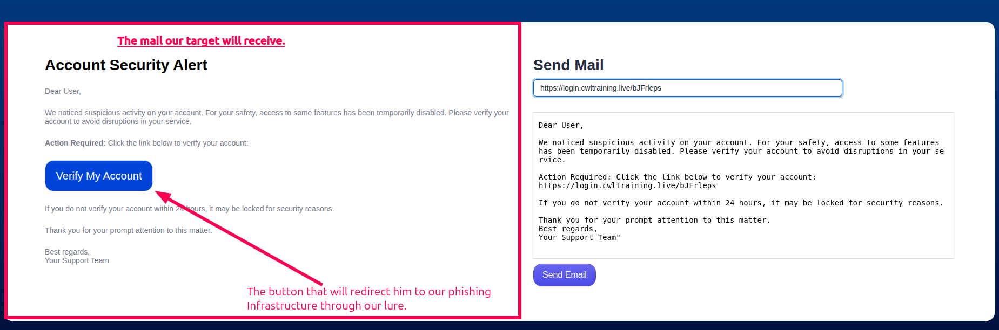
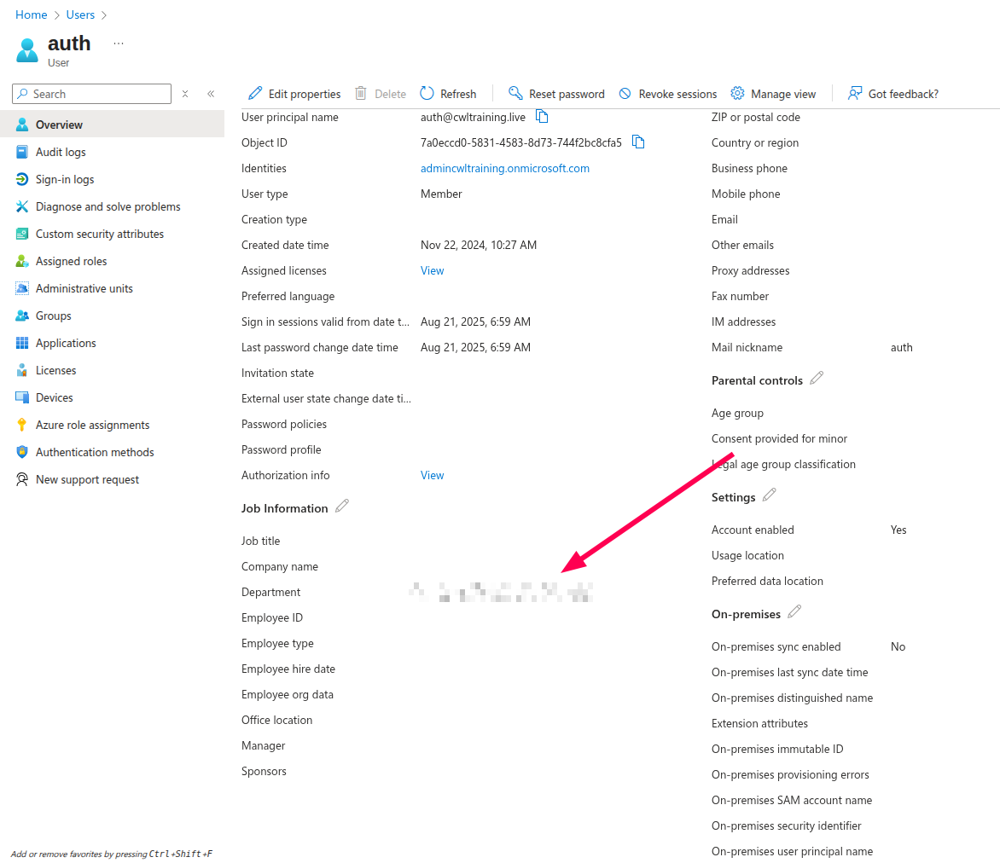

# Star Blizzard: MFA Bypasss Via AiTM  

## TL;DR  

This is a hard-rated APT lab mimicking the Russian APT Group Star Blizzard, which is, as of 2025, considered [active](https://www.microsoft.com/en-us/security/blog/2023/12/07/star-blizzard-increases-sophistication-and-evasion-in-ongoing-attacks/).  

This lab replicates a spear-phishing compaign. Although we're not responsible for building the whole evilginx infrastructure or the mail delivery infrastrucutre, but it is good to see how things work from the outside and how MFA is bypasssed with modern day phishng techniques.  

Here is the whole plan of this lab:  

## Preparing the phishing mail

### The lure  

The lure is the link we will send to our target in whatever format our compaign accepts.  The lure must look convincing, replicates a legit domain name, has a TLD that makes sense, and a legit-looking path.  

  

Although this is a Lab, the lure should've been more convincing like: `login.cwltraining.live/login`  which is easily done within evilginx.  

### The phishing mail  

Upon creating the lure, we need to create a legit-looking and convincing email.  It should replicate a template of previous mails sent by the legit service/person we're trying to mimic.  

  

And the mail is sent! Now we sit and wait for our target:  

  

And we got a hit.  

### Credentials theft  

  

We can now view our intercepted tokens, even though the MFA is enabled, we successfully bypassed it.

  

Now we can visit the real miscorosft website, inject our valid cookies, either using devtools or with StorageAce extension.  

  

### Flag  

Now that we have access to the account, everything linked is accessible to us.  

The flag should be at the account's information proprieties at the Azure portal.  

  

### Conclusion  

The lab as hard as it is rated, but it shows a top-level look at the phishing compaigns and how they're performed without taking a look at the infrastrucutre behind. Which could make it much richer content if that was the case.  